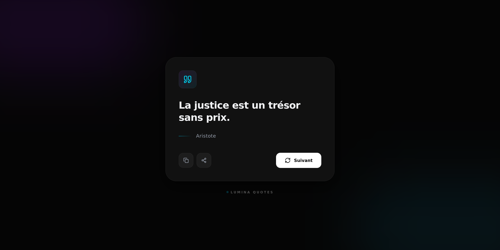

# ✨ Lumina Quotes - Mini Random Quote Generator

**Lumina Quotes** est une application web moderne et minimaliste qui génère des citations inspirantes, motivantes et innovantes. Conçue avec une approche "Dark Premium", l'interface offre une expérience utilisateur fluide grâce à des animations cinématographiques et un design épuré.

## 🚀 Fonctionnalités

- **Génération Aléatoire :** Affiche une nouvelle citation à chaque clic avec une rotation fluide.
- **Design Dark Mode :** Interface haut de gamme utilisant le glassmorphism et des effets de flou (blur).
- **Animations Fluides :** Transitions vaporeuses sur le texte et les icônes via `Framer Motion`.
- **Copie en un clic :** Bouton intégré pour copier la citation et l'auteur directement dans le presse-papier.
- **Responsive Design :** Optimisé pour mobile, tablette et desktop.
- **Typage Strict :** Entièrement développé en TypeScript pour une meilleure maintenabilité.

## 🛠️ Stack Technique

- **Framework :** [React.js](https://reactjs.org/)
- **Langage :** [TypeScript](https://www.typescriptlang.org/)
- **Styles :** [Tailwind CSS](https://tailwindcss.com/)
- **Animations :** [Framer Motion](https://www.framer.com/motion/)
- **Icônes :** [Lucide React](https://lucide.dev/)
- **Données :** Fichier JSON local situé dans le répertoire `/public`.

## 📦 Installation et Lancement

1. **Cloner le dépôt :**

```bash
   git clone https://github.com/ranto-dev/lumina-quotes.git
   cd lumina-quotes
```

2. **Installer les dépendances :**

```bash
npm install
```

3. **Lancer le serveur de développement :**

```bash
npm run dev
```
